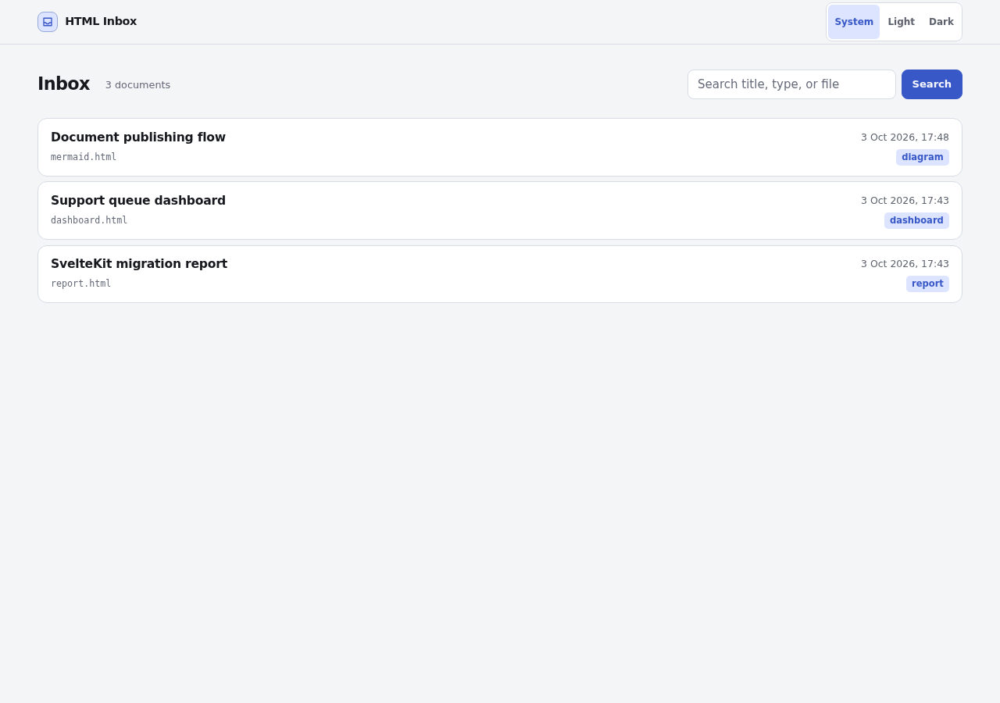
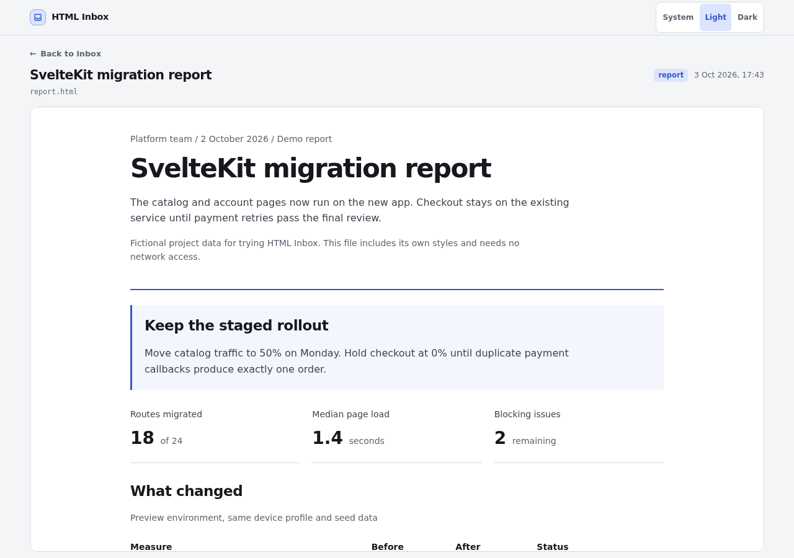
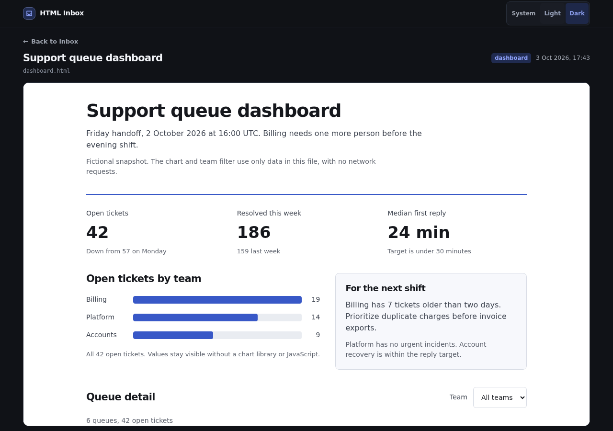
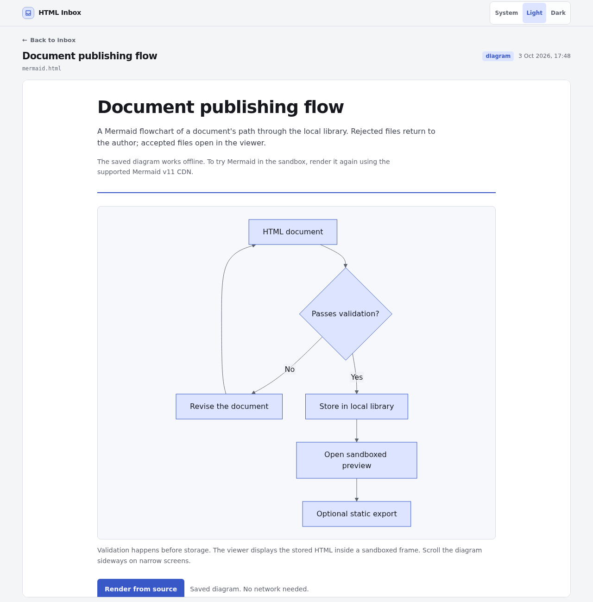
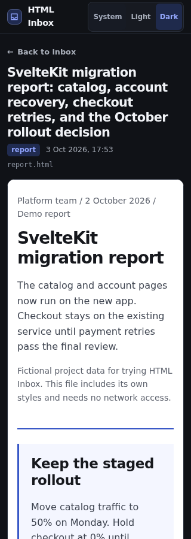

# Try the examples

From a built source checkout, publish any of these files. Each command prints
its local viewer URL. Open that URL, then use **Back to inbox** to see the library.

```sh
corepack pnpm html-inbox publish ./examples/report.html \
  --title "SvelteKit migration report" --type report
corepack pnpm html-inbox publish ./examples/dashboard.html \
  --title "Support queue dashboard" --type dashboard
corepack pnpm html-inbox publish ./examples/mermaid.html \
  --title "Document publishing flow" --type diagram
```

If you use the installed CLI, replace `corepack pnpm html-inbox` with
`html-inbox`. See the [source checkout instructions](../README.md#set-up-a-source-checkout-for-development)
if you have not built the CLI yet.

| File | What to try |
| --- | --- |
| [report.html](../examples/report.html) | Read the rollout decision and results table. Open "How the measurements were taken". |
| [dashboard.html](../examples/dashboard.html) | Select Billing, Platform, or Accounts. The queue table and its ticket count update locally. |
| [mermaid.html](../examples/mermaid.html) | View the saved flowchart and expand its source. Choose "Render from source" to run Mermaid v11 in the preview. |

All data is fictional. The report and dashboard need no network access.
The Mermaid file includes a saved SVG rendered from its source, so it also
works offline. "Render from source" loads the allowlisted Mermaid v11 module
and diagram chunks from jsDelivr. If the CDN is unavailable, the saved diagram
and source remain readable.

The examples use inline CSS, native HTML controls, and scripts registered with
`addEventListener`. They need no framework, external stylesheet, image, font,
or data service. The viewer's appearance selector changes the viewer shell;
each document keeps its own styling.

## In the viewer

These Chromium captures show the actual local viewer with the files above.
The desktop images use a 1280 × 900 viewport, with a taller 1280 × 1300 capture
for the flowchart. The narrow image uses 320 × 900. The narrow capture uses an
extra copy of the report with a longer title to check wrapping.











To check the controls, choose Light or Dark, reload, and confirm the choice
persists. Keyboard users can tab to Appearance and use the arrow keys to switch
options. Search the inbox for `dashboard` or `report` to find those examples.
